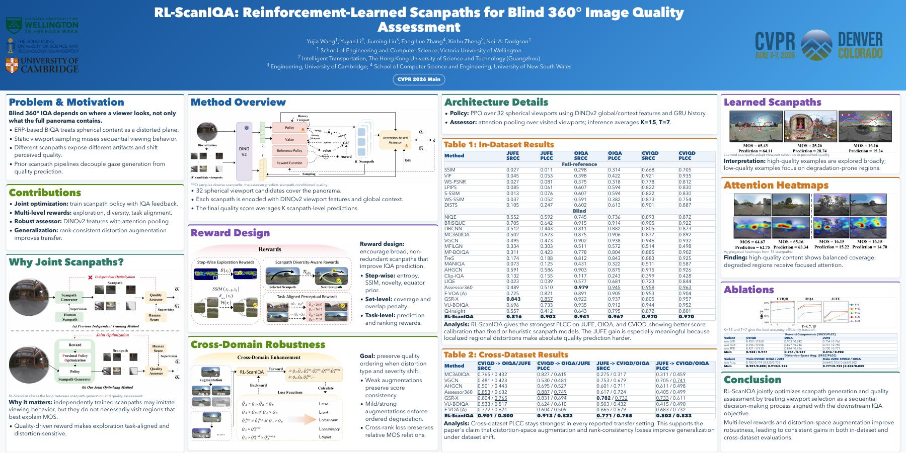
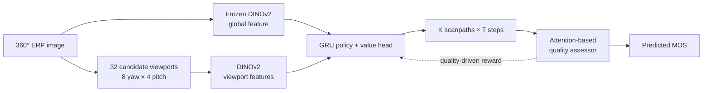
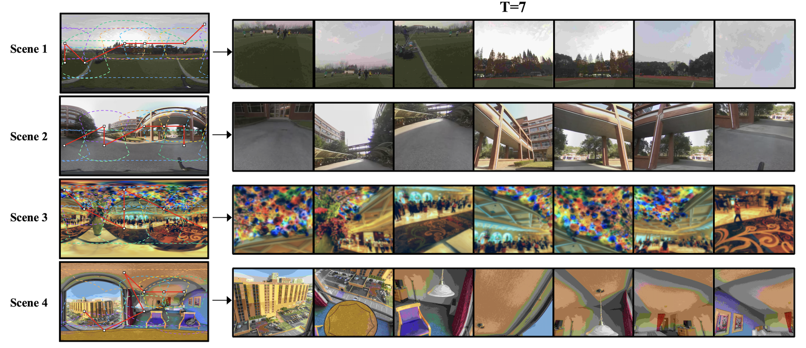
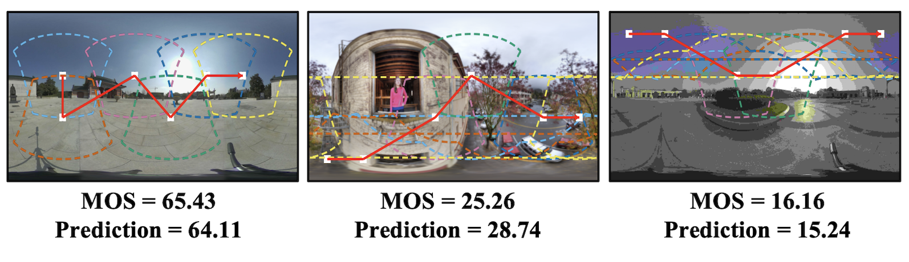
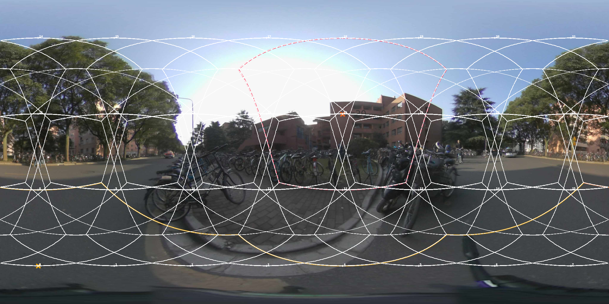
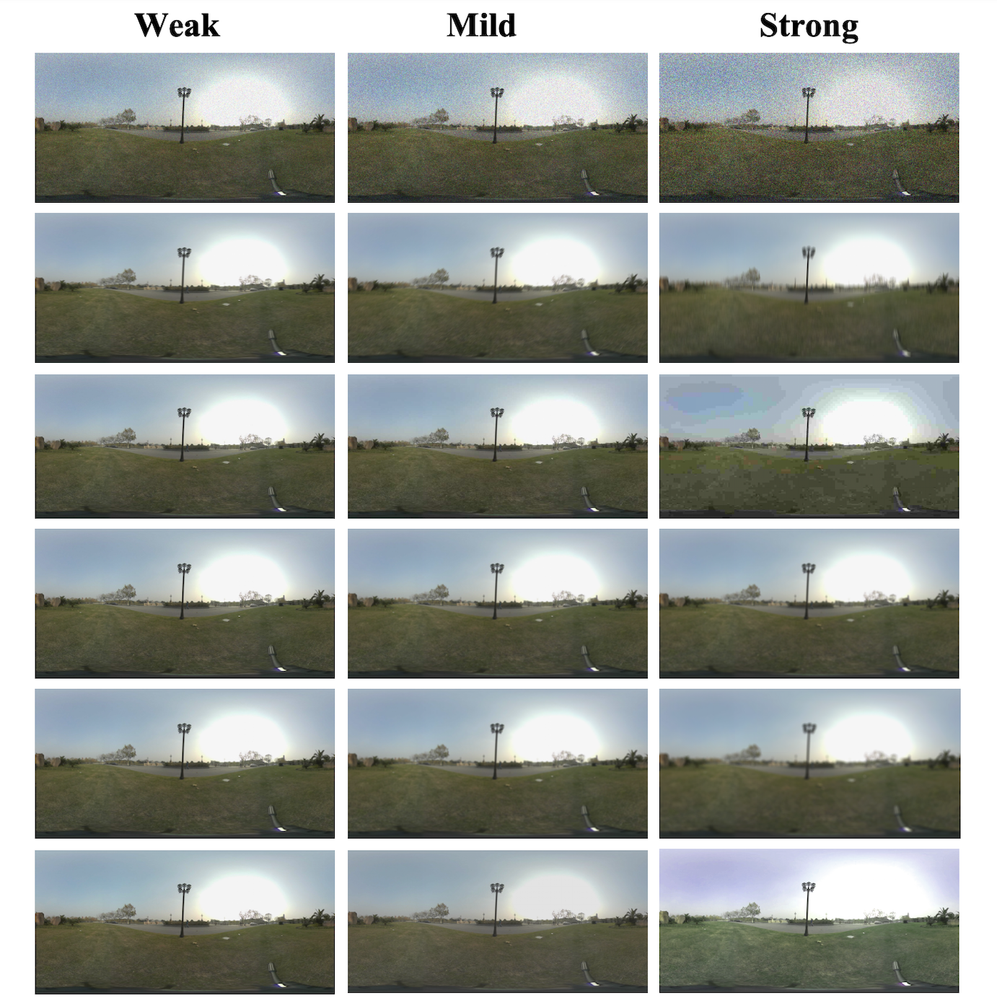

<div align="center">

# RL-ScanIQA

### Reinforcement-Learned Scanpaths for Blind 360° Image Quality Assessment

[](https://openaccess.thecvf.com/content/CVPR2026/html/Wang_RL-ScanIQA_Reinforcement-Learned_Scanpaths_for_Blind_360deg_Image_Quality_Assessment_CVPR_2026_paper.html)
[](https://github.com/wangyuji1/RLScanIQA/actions/workflows/tests.yml)
[](https://www.python.org/)
[](https://pytorch.org/)

**Yujia Wang · Yuyan Li · Jiuming Liu · Fang-Lue Zhang · Xinhu Zheng · Neil A. Dodgson**

**Accepted at CVPR 2026 · Proceedings pp. 37401–37412 (12 pages)**

[[CVF Paper](https://openaccess.thecvf.com/content/CVPR2026/html/Wang_RL-ScanIQA_Reinforcement-Learned_Scanpaths_for_Blind_360deg_Image_Quality_Assessment_CVPR_2026_paper.html)] · [[arXiv](https://arxiv.org/abs/2603.14297)] · [[Results](docs/RESULTS.md)] · [[Reproducibility](docs/REPRODUCIBILITY.md)]

</div>



RL-ScanIQA, published in the **CVPR 2026 proceedings**, formulates blind 360° image quality assessment as **active perception**. A PPO-trained policy learns where to look, while an attention-based quality assessor learns how those selected viewports explain perceptual quality. Both components are optimized jointly from IQA supervision, without requiring human scanpath annotations.

## Highlights

- **Task-driven scanpaths** — viewport selection is optimized for quality assessment instead of imitating gaze trajectories.
- **Multi-level rewards** — step-wise exploration, scanpath-set diversity, and task-aligned perceptual feedback stabilize policy learning.
- **Cross-domain robustness** — distortion-space augmentation and rank-consistent losses improve transfer across 360° IQA datasets.
- **Research-ready release** — reusable PyTorch modules, a runnable reference trainer, paper settings, tests, and curated qualitative results.

## Method at a glance



The paper setting uses 32 candidates, a 90° × 90° field of view, 224 × 224 viewports, and averages `K=15` scanpaths of length `T=7` at inference.

## Paper-reported performance

| Dataset | SRCC ↑ | PLCC ↑ |
|:--|--:|--:|
| JUFE | 0.816 | 0.902 |
| OIQA | 0.941 | 0.967 |
| CVIQD | **0.970** | **0.970** |

These values are transcribed from the paper's in-dataset table. The release does not bundle trained checkpoints or raw experiment logs, so they are **paper-reported results rather than claims reproduced by this checkout**. Cross-dataset results and ablations are collected in [docs/RESULTS.md](docs/RESULTS.md).

## Installation

```bash
git clone https://github.com/wangyuji1/RLScanIQA.git
cd RLScanIQA

python -m venv .venv
source .venv/bin/activate
python -m pip install --upgrade pip
python -m pip install -e .
```

For development and tests:

```bash
python -m pip install -e ".[dev]"
pytest -q
```

## Quick smoke test

The reference trainer can generate a tiny synthetic pair dataset when `--pairs_csv` is empty. The following command validates the end-to-end code path on CPU; it is not a paper-scale experiment:

```bash
python scripts/train_reference.py \
  --pairs_csv '' \
  --epochs 1 \
  --batch_size 8 \
  --device cpu \
  --n_yaw 2 \
  --n_pitch 1 \
  --K 1 \
  --T 1 \
  --viewport_hw 32 \
  --d_f 32 \
  --d_h 32
```

For the paper-scale geometry and inference settings, start from:

```bash
python scripts/train_reference.py \
  --pairs_csv /path/to/pairs.csv \
  --img_root /path/to/erp_images \
  --epochs 300 \
  --batch_size 4 \
  --device cuda \
  --backbone dino \
  --K 15 \
  --T 7
```

The DINOv2 option downloads model code and weights through `torch.hub` on first use. See [docs/REPRODUCIBILITY.md](docs/REPRODUCIBILITY.md) before running full experiments.

## Data format

Raw CVIQD, OIQA, and JUFE data are intentionally not redistributed. The reference trainer expects pair supervision:

```csv
img1,img2,Q1,Q2
images/example_a.jpg,images/example_b.jpg,64.67,16.15
```

Paths are resolved relative to `--img_root`. A malformed CSV or a missing image raises an error instead of silently substituting synthetic data. See [examples/pairs.example.csv](examples/pairs.example.csv) and [docs/DATASETS.md](docs/DATASETS.md).

## Repository layout

```text
RLScanIQA/
├── rl_scaniqa/              # Reusable policy, PPO, rewards, losses, and geometry
├── scripts/
│   └── train_reference.py   # Runnable reference training path
├── tests/                   # CPU unit and smoke tests
├── assets/                  # Curated paper/supplementary visualizations
├── docs/                    # Results, datasets, and reproducibility notes
├── examples/                # Input-format examples
├── CITATION.cff
└── pyproject.toml
```

## Qualitative examples

### Learned scanpaths



### MOS predictions



<details>
<summary><b>More supplementary visualizations</b></summary>

#### Candidate viewport grid



#### Weak, mild, and strong distortion-space augmentation



</details>

## Citation

If this work helps your research, please cite:

```bibtex
@InProceedings{Wang_2026_CVPR,
  author    = {Wang, Yujia and Li, Yuyan and Liu, Jiuming and Zhang, Fang-Lue and Zheng, Xinhu and Dodgson, Neil A.},
  title     = {RL-ScanIQA: Reinforcement-Learned Scanpaths for Blind 360deg Image Quality Assessment},
  booktitle = {Proceedings of the IEEE/CVF Conference on Computer Vision and Pattern Recognition (CVPR)},
  month     = {June},
  year      = {2026},
  pages     = {37401--37412}
}
```

Machine-readable metadata is available in [CITATION.cff](CITATION.cff).

## Release notes and licensing

- This repository does **not** include the benchmark datasets, private review material, pretrained checkpoints, or personal documents.
- The standalone trainer is a readable reference implementation. Exact paper reproduction additionally depends on the authors' dataset preprocessing, split files, DINOv2 setup, and training infrastructure.
- No open-source license has been selected yet. Until the authors choose one, standard copyright applies; please contact the authors before reuse or redistribution.

## Acknowledgements

This work was supported by the Marsden Fund Council, managed by the Royal Society of New Zealand, under Grant MFP-20-VUW-180.
